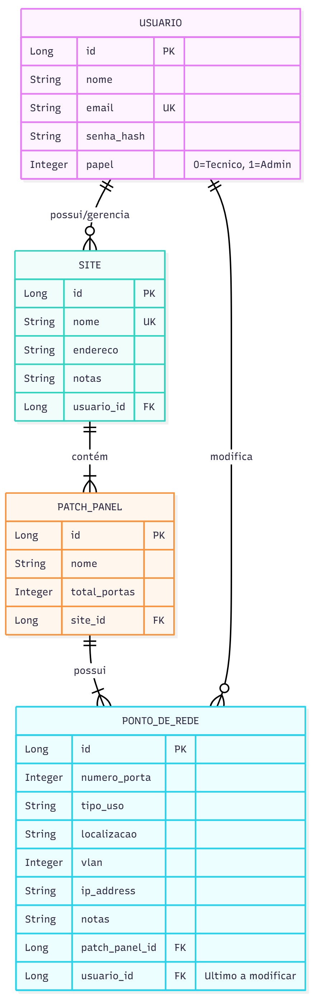

# 📡 NetManager — Gerenciador de Documentação de Redes

## 1. O Problema

A documentação de infraestrutura de rede física em empresas, clínicas e agências é frequentemente feita em documentos estáticos como planilhas ou arquivos `.docx`. Este método é descentralizado, difícil de consultar e propenso a desatualização, gerando desafios como:

* **Dificuldade na Manutenção:** Identificar rapidamente qual dispositivo está conectado à porta `LG.01.15` de um patch panel é uma tarefa manual e demorada.
* **Falta de Visão Centralizada:** É impossível ter uma visão geral e em tempo real da ocupação de portas, VLANs em uso ou do "tamanho" da infraestrutura de cada cliente.
* **Ineficiência Operacional:** Técnicos em campo perdem tempo consultando documentos desatualizados, o que pode levar a erros de configuração.

O **NetManager** resolve este problema ao substituir a documentação estática por uma plataforma web dinâmica, centralizada e multiusuário, otimizada para a gestão de racks e patch panels.

---

## 2. Arquitetura e System Design

A documentação visual completa da arquitetura encontra-se na pasta [`/docs/system-design`](./docs/system-design) deste repositório.

### 2.1. Diagrama de Contexto
Visão macro das interações entre os usuários (Admin/Técnico) e o sistema.


### 2.2. Diagrama de Containers
Detalhamento da arquitetura técnica (React SPA, Spring Boot API, PostgreSQL) e protocolos de comunicação.


### 2.3. Modelo de Dados (ERD)
Estrutura do banco de dados relacional, demonstrando as relações entre Usuários, Sites, Painéis e Portas.


### 2.4. Diagramas de Sequência (Login)
Fluxo detalhado de autenticação e operação crítica.


### 2.4. Diagramas de Sequência (Edição)
Fluxo de Edição de Porta

NetManager\docs\system-design
---

## 3. Tecnologias e Decisões Técnicas

O sistema segue o modelo moderno **SPA (Single Page Application) + API REST**.

### 3.1 Frontend (Interface do Usuário)
* **Framework:** **React** com **JavaScript**.
* **Estilização:** **React Bootstrap** e **Bootstrap**, com um tema escuro customizado inspirado no Gemini.
* **Bibliotecas-chave:**
    * `Vite`: Ferramenta de build rápida e leve.
    * `React Router DOM`: Gerenciamento de rotas no cliente.
    * `Axios`: Cliente HTTP para comunicação com a API.
    * `@tanstack/react-query`: Gerenciamento de estado assíncrono e cache de dados.
    * `react-pro-sidebar`: Componente para o menu lateral responsivo.
    * `chart.js` e `react-chartjs-2`: Renderização de gráficos no dashboard.
    * `react-awesome-reveal`: Animações de entrada de componentes.

### 3.2 Backend (Servidor)
* **Framework:** **Java 17** com **Spring Boot**.
* **Banco de dados:** **PostgreSQL**.
* **Segurança:**
    * **JWT (JSON Web Tokens):** Escolhido para garantir uma autenticação *stateless* (sem sessão no servidor), facilitando a escalabilidade.
    * **BCrypt:** Para hash seguro de senhas antes da persistência.
    * **Spring Security:** Controle de acesso baseado em papéis (`ROLE_ADMIN`, `ROLE_USER`).

---

## 4. Atores e Permissões

* 👨‍💻 **Administrador (Nível 1)**
    * Possui visão completa de **todos** os racks/clientes cadastrados no sistema.
    * Pode criar, editar e remover qualquer dado.
    * Acesso exclusivo ao menu "Gerenciar Usuários" para alterar papéis.

* 🛠️ **Técnico (Nível 2)**
    * Possui uma visão restrita aos dados que ele mesmo criou.
    * Pode cadastrar e gerenciar **apenas os seus próprios** racks/clientes.
    * Não visualiza dados sensíveis de outros técnicos.

---

## 5. Casos de Uso e Funcionalidades

#### Todos os Usuários
* ✅ Fazer login/logout no sistema.
* ✅ Acessar a página de "Meu Perfil" para editar suas próprias informações (Nome/Email).
* ✅ Visualizar a página de "Ajuda" com a documentação do sistema.

#### Funcionalidades de Gestão (Racks e Portas)
* ✅ **Dashboard:** Visualizar estatísticas gráficas de ocupação de portas e total de racks.
* ✅ **Gerenciar Racks (Sites):** Criar, editar e excluir locais de instalação.
* ✅ **Gerenciar Patch Panels:** Adicionar painéis (ex: "LG.01") que geram automaticamente 24 portas vagas.
* ✅ **Gerenciar Portas:** Editar detalhes de cada porta (Uso, Localização, VLAN, IP).
* ✅ **Busca e Filtros:** Filtrar portas por tipo de uso ou buscar por localização.
* ✅ **Importação Inteligente:** Importar dados de planilhas Excel (`.xlsx`), com suporte a arquivos despadronizados ("sujos").

---

## 6. Endpoints Principais da API

A API REST expõe os seguintes recursos principais:

| Método | Endpoint | Descrição | Acesso |
| :--- | :--- | :--- | :--- |
| `POST` | `/auth/login` | Autentica usuário e retorna Token JWT | Público |
| `POST` | `/auth/register` | Registra novo usuário | Público |
| `GET` | `/api/sites` | Lista Racks (todos p/ Admin, próprios p/ Técnico) | Autenticado |
| `POST` | `/api/sites` | Cria novo Rack | Autenticado |
| `POST` | `/api/sites/{id}/import-data`| Importa dados via Excel | Dono/Admin |
| `GET` | `/api/dashboard/general-stats`| Estatísticas gerais para os cards | Autenticado |
| `GET` | `/api/pontos-de-rede/by-panel/{id}`| Lista portas de um painel | Autenticado |
| `PUT` | `/api/pontos-de-rede/{id}` | Atualiza dados da porta | Dono/Admin |
| `GET` | `/api/usuarios` | Lista todos os usuários | **Admin** |

---

## ⚙️ Como Executar o Projeto Localmente

### Pré-requisitos
* JDK (Java 17 ou superior)
* Apache Maven (ou usar o wrapper `./mvnw` incluso)
* PostgreSQL
* Node.js (LTS v18+) e npm
* Git

### 1. Banco de Dados
1.  Certifique-se de que o serviço do PostgreSQL está rodando.
2.  Crie o banco de dados e o usuário:
    ```sql
    CREATE USER netmanager WITH PASSWORD 'matrix007!';
    CREATE DATABASE netmanager_db OWNER netmanager;
    ```
3.  Execute o script `database/NETmanager__.sql` para criar as tabelas.
    * *Nota: Certifique-se de inserir um usuário Admin no banco para conseguir logar pela primeira vez.*

### 2. Backend (API)
1.  Abra um terminal na pasta `backend`.
2.  Verifique o arquivo `src/main/resources/application.properties` se as credenciais do banco conferem.
3.  Execute o servidor:
    ```bash
    ./mvnw spring-boot:run
    ```
4.  A API estará disponível em: **`http://localhost:8081`**.

### 3. Frontend (React App)
1.  Abra um novo terminal na pasta `frontend`.
2.  Instale as dependências:
    ```bash
    npm install
    ```
3.  Inicie a aplicação:
    ```bash
    npm run dev
    ```
4.  Acesse no navegador: **`http://localhost:5173`**.

---

## 🔐 Usuários de Teste

Para avaliação e testes imediatos, utilize as credenciais abaixo (caso tenha executado o seed do banco):

| Perfil | Email | Senha |
| :--- | :--- | :--- |
| **Administrador** | `ebertzgiordan@gmail.com` | `Matrix007!` |
| **Técnico**       | `teste3@gmail.com` | `Matrix007!` |

---

## 🌍 Variáveis de Ambiente (.env)

Para execução local, as configurações padrão estão no `application.properties`. Para deploy em produção (ex: Render), configure as seguintes variáveis de ambiente:

```properties
SPRING_DATASOURCE_URL=jdbc:postgresql://<HOST>:<PORT>/<DB_NAME>
SPRING_DATASOURCE_USERNAME=<SEU_USUARIO>
SPRING_DATASOURCE_PASSWORD=<SUA_SENHA>
API_SECURITY_TOKEN_SECRET=<SEU_SEGREDO_JWT>