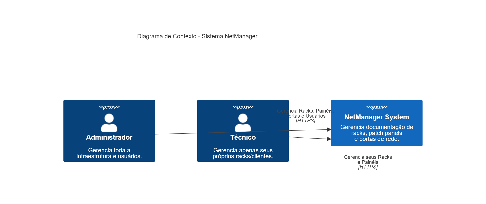
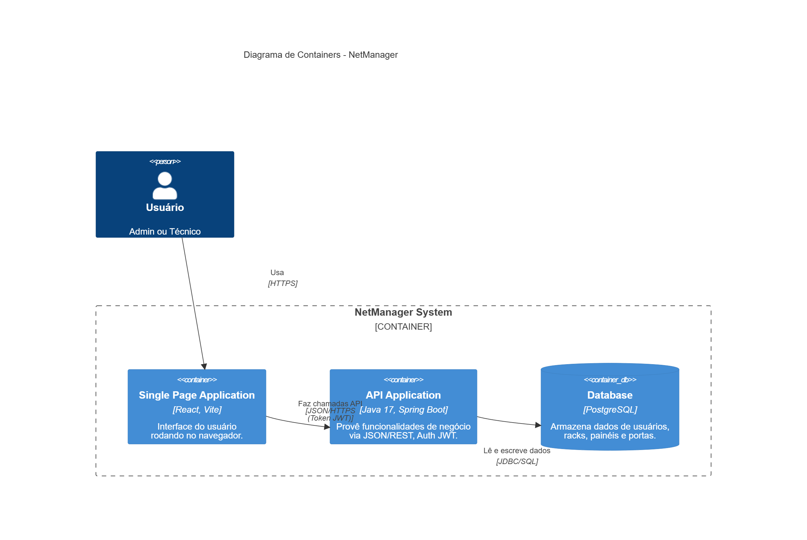
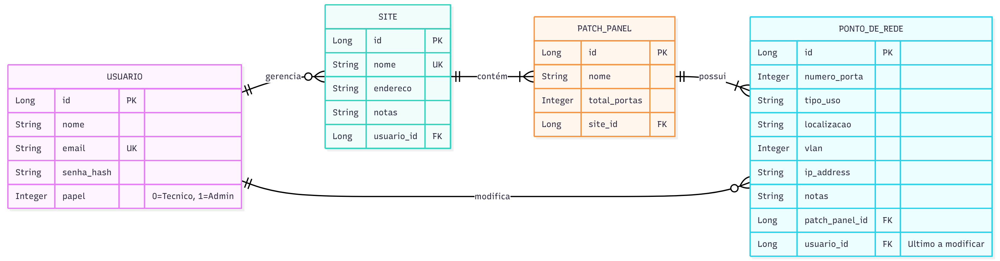
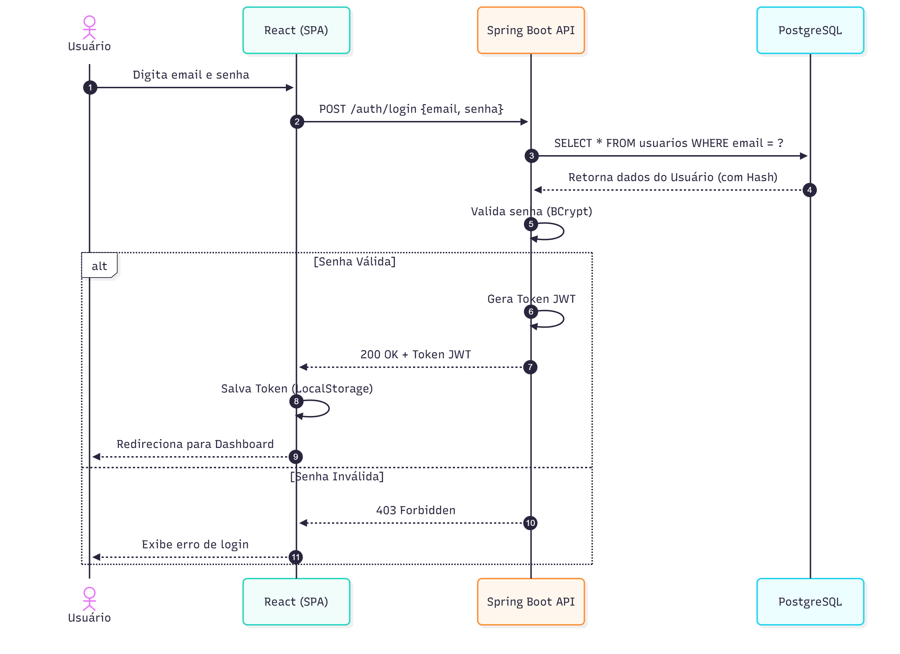
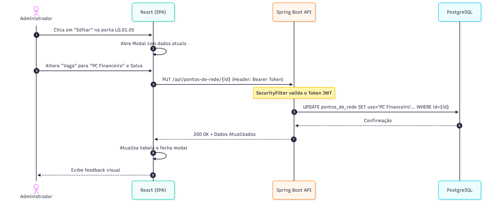
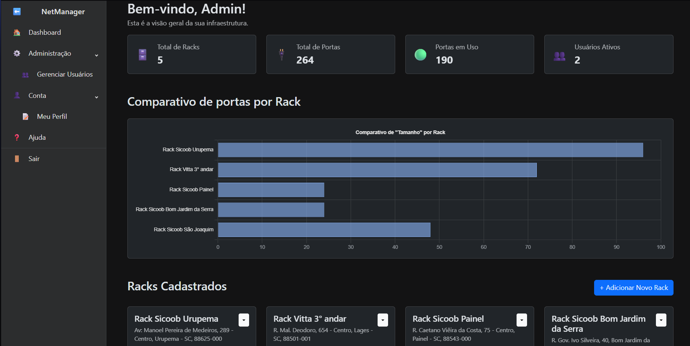
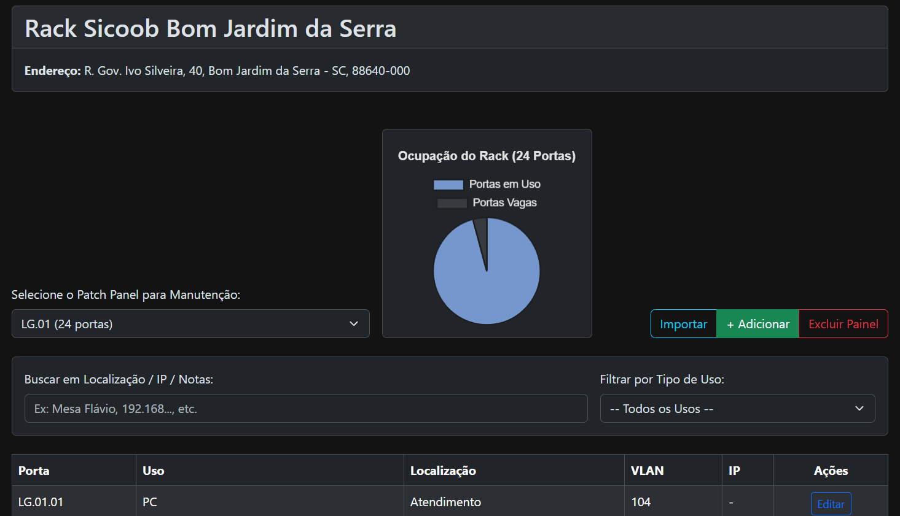
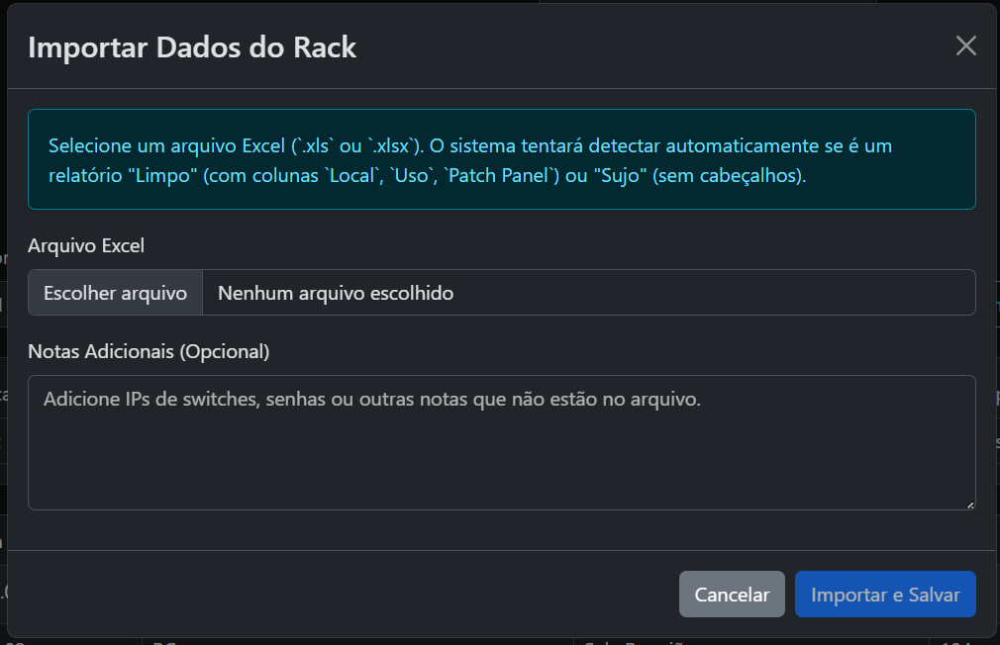

# 📡 NetManager — Gerenciador de Documentação de Redes

## 1. O Problema

A documentação de infraestrutura de rede física em empresas, clínicas e agências é frequentemente feita em documentos estáticos, como planilhas ou arquivos `.docx` descentralizados. Este método gera desafios como:

* **Dificuldade na Manutenção:** Identificar rapidamente qual dispositivo está conectado à porta `LG.01.15` de um patch panel é uma tarefa manual e demorada.
* **Falta de Visão Centralizada:** É impossível ter uma visão geral e em tempo real da ocupação de portas, VLANs em uso ou do "tamanho" da infraestrutura de cada cliente.
* **Ineficiência Operacional:** Técnicos em campo perdem tempo consultando documentos desatualizados, o que pode levar a erros de configuração (ex: desconectar o cabo errado).

O **NetManager** resolve este problema ao substituir a documentação estática por uma plataforma web dinâmica, centralizada e multiusuário, otimizada para a gestão de racks e patch panels.

---

## 2. Atores e Decisores

* **Usuários principais**:
    * 👨‍💻 **Administrador (Nível 1)** → Possui visão completa de todos os racks/clientes cadastrados no sistema. Pode criar, editar e remover qualquer dado, além de gerenciar outros usuários.
    * 🛠️ **Técnico (Nível 2)** → Possui uma visão restrita. Pode cadastrar e gerenciar **apenas os seus próprios** racks/clientes, sem visualizar os dados de outros técnicos.

---

## 3. Casos de Uso

#### Todos os Usuários
* ✅ Fazer login/logout no sistema.
* ✅ Acessar a página de "Meu Perfil" para editar suas próprias informações ou excluir a conta.
* ✅ Visualizar a página de "Ajuda" com a documentação do sistema.

#### Administrador
* ✅ Visualizar dashboards com estatísticas **globais** de toda a infraestrutura.
* ✅ Criar, visualizar, editar e remover **todos** os racks/clientes.
* ✅ Acessar a tela de "Gerenciar Usuários" para visualizar e editar os papéis dos usuários cadastrados.

#### Técnico
* ✅ Visualizar dashboards com estatísticas **exclusivas** de seus próprios racks.
* ✅ Criar, visualizar, editar e remover **apenas os seus próprios** racks.
* ✅ **Gerenciar Patch Panels:** Adicionar painéis que geram automaticamente suas portas.
* ✅ **Gerenciar Portas:** Editar uso, localização, VLAN e IP de cada porta de rede.
* ✅ **Importação Inteligente:** Importar dados legados de planilhas Excel ("sujas" ou limpas).

---

## 4. Limites e Suposições

* **Limites:** A aplicação foca na documentação **física e lógica passiva**. Não realiza monitoramento ativo (ping/SNMP) dos dispositivos.
* **Suposições:** O técnico alimentará os dados corretamente após as manutenções; O sistema deve ser responsivo para uso em tablets/notebooks em campo.
* **Plano B:** Em caso de falha de conexão, o sistema pode ser rodado localmente via Docker (futuro).

---

## 5. Hipóteses e Validação

* **H-Valor:** Se os técnicos puderem importar planilhas antigas sem precisar formatá-las antes, a adesão ao sistema será mais rápida.
    * *Validação:* Teste da funcionalidade de importação com arquivos reais despadronizados ("sujos").
* **H-Usabilidade:** A visualização gráfica (Pizza/Barras) permite identificar a necessidade de expansão de um rack em menos de 5 segundos.
    * *Validação:* Medir tempo de resposta do usuário ao analisar o Dashboard.

---

## 6. Arquitetura e System Design

A documentação visual completa da arquitetura encontra-se na pasta [`/docs/system-design`](./docs/system-design) deste repositório.

### 6.1. Diagrama de Contexto
Visão macro das interações entre os usuários (Admin/Técnico) e o sistema.



### 6.2. Diagrama de Containers
Detalhamento da arquitetura técnica (React SPA, Spring Boot API, PostgreSQL) e protocolos de comunicação.


### 6.3. Modelo de Dados (ERD)
Estrutura do banco de dados relacional, demonstrando as relações entre Usuários, Sites, Painéis e Portas.


### 6.4. Diagramas de Sequência
**Fluxo de Login:**



**Fluxo de Edição de Porta:**


---

## 7. Interface do Sistema (Telas)

**Dashboard Principal:**


**Detalhes do Rack:**


**Importação de Dados:**


---

## 8. Tecnologias e Decisões Técnicas

O sistema segue o modelo moderno **SPA (Single Page Application) + API REST**.

### 8.1 Frontend (Interface do Usuário)
* **Framework:** React com JavaScript.
* **Estilização:** React Bootstrap e Bootstrap (Tema Escuro).
* **Bibliotecas-chave:**
    * `Vite`: Build tool.
    * `React Router DOM`: Navegação.
    * `Axios`: Cliente HTTP.
    * `@tanstack/react-query`: Gerenciamento de estado server-side.
    * `chart.js`: Gráficos.

### 8.2 Backend (Servidor)
* **Framework:** Java 17 com Spring Boot.
* **Banco de dados:** PostgreSQL.
* **Segurança:**
    * **JWT:** Autenticação *stateless* (escalável).
    * **BCrypt:** Hash de senhas.
    * **Spring Security:** Controle de acesso (RBAC).

---

## 9. Plano de Dados

### 9.1 Entidades

| Entidade | Descrição | Relacionamentos |
| :--- | :--- | :--- |
| **Usuario** | Profissional que acessa o sistema (Admin ou Técnico). | Possui N Sites. |
| **Site** | Representa um "Rack" ou "Cliente" físico. | Pertence a 1 Usuário; Possui N PatchPanels. |
| **PatchPanel** | Equipamento físico (ex: 24 portas). | Pertence a 1 Site; Possui N PontoDeRede. |
| **PontoDeRede** | A porta individual com suas configurações (VLAN, IP, Uso). | Pertence a 1 PatchPanel. |

### 9.2 Estrutura do Banco (SQL)

```sql
-- Tabela de Usuários
CREATE TABLE usuarios (
    id SERIAL PRIMARY KEY,
    nome VARCHAR(100) NOT NULL,
    email VARCHAR(100) NOT NULL UNIQUE,
    senha_hash VARCHAR(255) NOT NULL,
    papel SMALLINT NOT NULL CHECK (papel IN (0, 1)) -- 0: Técnico, 1: Admin
);

-- Tabela de Sites (Racks)
CREATE TABLE sites (
    id SERIAL PRIMARY KEY,
    nome VARCHAR(100) NOT NULL UNIQUE,
    endereco VARCHAR(255),
    notas TEXT,
    usuario_id INTEGER REFERENCES usuarios(id) ON DELETE SET NULL
);

-- Tabela de Patch Panels
CREATE TABLE patch_panels (
    id SERIAL PRIMARY KEY,
    nome VARCHAR(100) NOT NULL,
    total_portas INTEGER NOT NULL,
    site_id INTEGER NOT NULL REFERENCES sites(id) ON DELETE CASCADE
);

-- Tabela de Pontos de Rede
CREATE TABLE pontos_de_rede (
    id SERIAL PRIMARY KEY,
    patch_panel_id INTEGER NOT NULL REFERENCES patch_panels(id) ON DELETE CASCADE,
    numero_porta INTEGER NOT NULL,
    tipo_uso VARCHAR(50) DEFAULT 'Vaga',
    localizacao VARCHAR(100),
    vlan INTEGER,
    ip_address VARCHAR(45),
    notas TEXT,
    usuario_id INTEGER REFERENCES usuarios(id) ON DELETE SET NULL
);

-- Seed Inicial (Usuários de Teste)
-- Senha padrão para ambos: Matrix007!
INSERT INTO usuarios (nome, email, senha_hash, papel) 
VALUES 
('Administrador', 'ebertzgiordan@gmail.com', '$2a$10$N.zmdr9k7uOcQb376hj9wu3.wKQW.gXZ2.qJ8.vZqj/.wZqj/.wZq', 1),
('Técnico Teste', 'teste3@gmail.com', '$2a$10$N.zmdr9k7uOcQb376hj9wu3.wKQW.gXZ2.qJ8.vZqj/.wZqj/.wZq', 0);
```
## **10\. Endpoints da API**

A API REST (Spring Boot) expõe os seguintes recursos principais:

### **Autenticação (AuthController)**

| Método | Rota | Descrição | Acesso |
| :---- | :---- | :---- | :---- |
| POST | /auth/login | Autentica usuário e retorna Token JWT. | Público |
| POST | /auth/register | Registra um novo usuário. | Público |

### **Sites / Racks (SiteController)**

| Método | Rota | Descrição | Acesso |
| :---- | :---- | :---- | :---- |
| GET | /api/sites | Lista todos os racks (Admin vê tudo, Técnico vê seus). | Autenticado |
| GET | /api/sites/{id} | Obtém detalhes de um rack específico. | Autenticado |
| POST | /api/sites | Cria um novo rack. | Autenticado |
| PUT | /api/sites/{id} | Atualiza dados do rack. | Dono/Admin |
| DELETE | /api/sites/{id} | Remove rack e seus componentes. | Dono/Admin |
| POST | /api/sites/{id}/import-data | Importação de dados via Excel. | Dono/Admin |

### **Patch Panels e Portas**

| Método | Rota | Descrição | Acesso |
| :---- | :---- | :---- | :---- |
| GET | /api/patch-panels/by-site/{id} | Lista painéis de um site. | Autenticado |
| POST | /api/patch-panels/by-site/{id} | Cria painel (gera 24 portas auto). | Dono/Admin |
| DELETE | /api/patch-panels/{id} | Exclui painel. | Dono/Admin |
| GET | /api/pontos-de-rede/by-panel/{id} | Lista portas de um painel. | Autenticado |
| PUT | /api/pontos-de-rede/{id} | Atualiza uso/vlan/descrição da porta. | Dono/Admin |

### **Usuários e Dashboard**

| Método | Rota | Descrição | Acesso |
| :---- | :---- | :---- | :---- |
| GET | /api/dashboard/general-stats | Estatísticas globais (Cards). | Autenticado |
| GET | /api/dashboard/site-stats/{id} | Estatísticas do rack (Gráfico). | Autenticado |
| GET | /api/usuarios/me | Dados do usuário logado. | Autenticado |
| PUT | /api/usuarios/me | Atualiza perfil próprio. | Autenticado |
| DELETE | /api/usuarios/me | Exclui própria conta. | Autenticado |
| GET | /api/usuarios | Lista todos os usuários. | **Admin** |

---

## **11\. Instalação e Execução**

### **11.1 Pré-requisitos**

* JDK (Java 17 ou superior)  
* Apache Maven  
* PostgreSQL  
* Node.js (LTS)  
* Git

### **11.2 Banco de Dados**

1. Crie o banco NETmanager\_db (ou netmanager\_db).  
2. Execute o script SQL acima para criar as tabelas e usuários.

### **11.3 Variáveis de Ambiente (.env)**

Crie um arquivo .env na raiz NetManager/ com suas credenciais locais:

Properties

DB\_URL\=jdbc:postgresql://localhost:5432/NETmanager\_db

DB\_USER\=netmanager

DB\_PASSWORD\=matrix007\!

JWT\_SECRET\=meu\_segredo\_bombastico

### **11.4 Backend (API)**

No terminal, navegue até NetManager/backend e execute:

Bash

\# Se usar VS Code, utilize o 'Run and Debug' configurado.

\# Se usar terminal puro, passe as variáveis antes do comando.

./mvnw spring-boot:run

A API estará em: **http://localhost:8081**.

### **11.5 Frontend (React App)**

No terminal, navegue até NetManager/frontend e execute:

Bash

npm install

npm run dev

Acesse no navegador: **http://localhost:5173**.

---

## **12\. Usuários de Teste**

| Perfil | Email | Senha |
| :---- | :---- | :---- |
| **Administrador** | admin@gmail.com | 12345678\! |
| **Técnico** | teste3@gmail.com | 12345678\! |

---

## **Agradecimentos**

Projeto desenvolvido como Trabalho Final da disciplina de Introdução ao Desenvolvimento Web \- IFSC.

